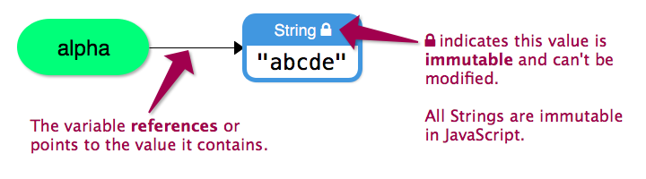
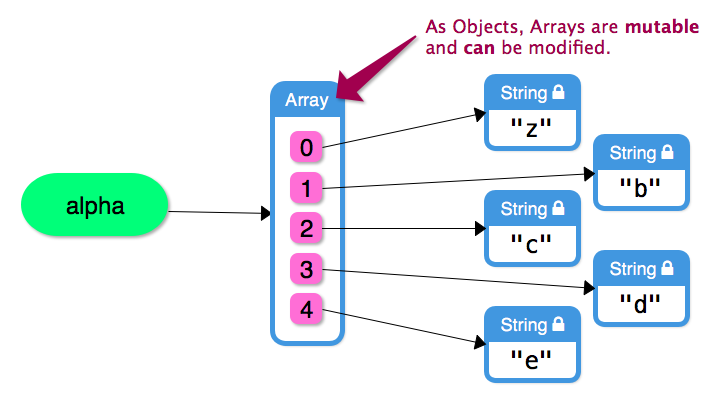
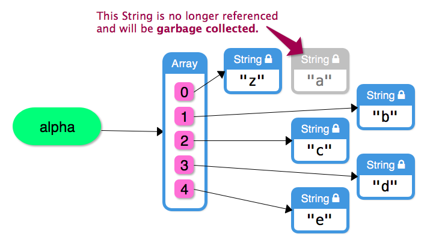
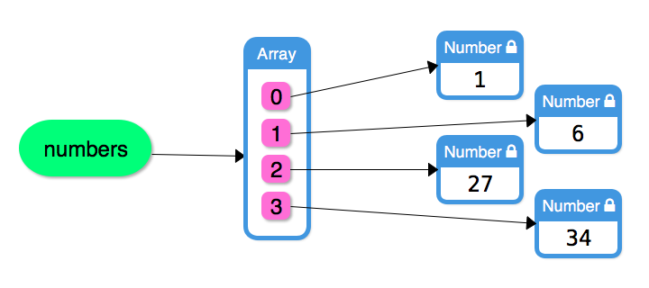
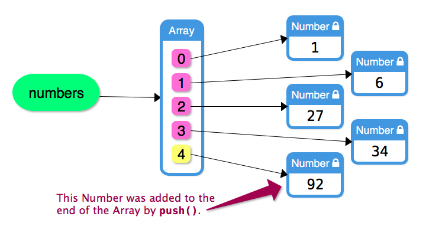

# 1	Introduction to Objects

Objects are a collection type,

Build-in Objects
- String, Array, Object,Math, Date

Primitive 
- number, boolean, string, null, undefined

Create Objects
- `var obj = {red:'#f00', green:'#ff0'};`

- `Object.create`
  
- `new`
```js
function Car(make, model, year) {
  this.make = make;
  this.model = model;
  this.year = year;
}
var mycar = new Car("Eagle", "Talon TSi", 1993);
```

trailing comma
- First, when there is a need to reorganize or re-position the contents of the object literal. With a trailing comma, you can move the last entry to any other position without having to add in the comma at the end.
- The second has to do with a cleaner git diff. Without a trailing a comma, adding a line would reflect as having 2 lines changes. One line had an addition of the comma at the end; the second the addition of the new item.

# 2	Object Properties

property name
- string with quotes
- or with quotes omitted, will be implicitly converted to string

property value
- value
- object
- function

access value 

- dot notation
  - `object.a; = object['a']` 
  - `object.nonexist;`  undefined, if property is not defined on the object
  - dot notation can be chained to "dig into" nested objects `foo.person.name;  `

- bracket notation
  - bracket notation can take expressions `foo['goo' + 'd']; =  foo['good'] `
  - bracket notation works with variables since they are expressions `var alias = 'a'; foo[alias]`

add property

  ```js
  var object = {};              // empty object

  object.a = 'foo';
  object.a;                     // "foo"

  object['a name'] = 'hello';
  object['a name'];             // "hello",

  object;                       // {a: "foo", a name: "hello"}
  ```

delete property

```js
var foo = {
  a: 'hello',
  b: 'world',
};

delete foo.a;
foo;                      // {b: "world"}
```


# 3	Stepping through Object Properties

- `for (variable in object)`

> Note: `for...in` should not be used to iterate over an Array where the index order is important.

```js
var nick;

var nicknames = {
  joseph: 'Joey',
  margaret: 'Maggie',
};

for (nick in nicknames) {
  console.log(nick);
  console.log(nicknames[nick]);
}
```

- `Object.keys(objname)` and `Object.values(objname)`

- `Object.assign()`

```js
var o1 = { a: 1, b: 1, c: 1 };
var o2 = { b: 2, c: 2 };
var o3 = { c: 3 };

var obj = Object.assign({}, o1, o2, o3);
console.log(obj); // { a: 1, b: 2, c: 3 }
```

# 4	Exercises: Working with Object Properties

Remember that attempting to access a property that doesn't exist in an object will return undefined.

`if(keys.indexOf(prop) === -1)` or `if (obj[prop])`

Since `undefined` is falsy and any Number is truthy, we can use the result of attempting to access the property in an if statement within incrementProperty to determine if the property already exists or not.

If null or undefined were a value that we might expect the object to contain (such as in the last exercise), we would need to check for the property's name in Object.keys() instead.

# 5	Arrays and Objects

Arrays and objects are JavaScript's choice of data structures to **represent compound data**.

Array
- a list that contains many items, oftentimes of the same type, but can be different types too
- add elements, remove elements, iterating through the Array
- **indexed access**

> If the data you are working with needs to maintain a specific order, it should probably be stored in an Array.

Object
- data is more like a entity that has many parts
- AKA 'associative arrays'
- **keyed access**

> If the data you are working with needs to provide access to values using the names of those values, it should probably be stored in an Object.

Arrays are Objects
- `index` is the `key`

  ```js
  var a = ['hello', 'world'];

  var a = {
    '0': 'hello',
    '1': 'world',
  }
  ```

> just because you can do so doesn't mean that you should
>
> Should not use `in` `delete` on `Array`, use `indexed loop`, `splice` instead

# 6	Mutability of Values and Objects

Primitive values are immutable. 
- They cannot be modified, and 
- operations on these values return a new value of the same type.


Objects are mutable, 
- which means that they can be changed while retaining the same identity. 
- This is because they contain data inside them that can be changed.

> All Strings are immutable in JavaScript








# 7	Pure Functions and Side Effects

## Non-Pure Function Side Effects

- **mutate arguments** 
- how Functions can **modify values outside of them** 
- either by accessing variables defined in outer scopes, or 
- by mutating Objects that were passed to the Function as an argument. 

>Functions that cause unexpected side effects can be a major source of bugs. When you write your functions, be mindful of all the side effects that it can cause.

## Pure Function Return Value 

- **return a new value**
- When a Function doesn't cause any **side effects** when it is invoked
- always reture values

# 8	Working with the Math Object

radians vs angles
- 180 degree = 3.14 * radian

`abs`: absolute value of a number

`sprt`: square root

`pow(x, y)`: return x(base) to the y(exponent) power. x的y次方
- `Math.pow(4, 0.5);`  // 2 (square root of 4)
- `Math.pow(8, 1/3);`  // 2 (cube root of 8)

`round`: rounded to the nearest integer.
- If the fractional portion of the argument is 0.5 or greater, the argument is rounded to the integer with the next higher absolute value. 
- Otherwise, the argument is rounded to the integer with the lower absolute value.

**why round(-0.5) is 0 but round(0.5) is 1**
- >= -0.5,  e.g. -0.5, -0.3 to next higher => 0
- < -0.5, e.g. -0.8 round down => -1

`ceil`: round down

`floor`: round up

`random`: random floating-point number between 0 and 1

# 9	Working with Dates

`getDay` zero-based index, day of the week, start from Sunday to Saturday

`getMonth` zero-based index, day of the month 

`getDate` 1-31, date of the month

`getFullYear` The value returned by getFullYear() is an absolute number. For dates between the years 1000 and 9999, getFullYear() returns a four-digit number

`getTime` A number representing the milliseconds elapsed between 1 January 1970 00:00:00 UTC and the given date.

# 10	Working with the Function Argument Object

`arguments`
- object
- Array-like, but not a real Array
- contains all arguments passed to the Function
- `arguments.length`that returns how many total arguments were passed to the Function
- `arguments[i]` to iterate all arguments
- `Array.prototype.slice.call();` this effectively creates an array equivalent for arguments

Functions that Accept Any Number of Arguments, but bad practice

# 11	Exercise: Welcome Stranger
# 12	Exercise: Repeated Characters