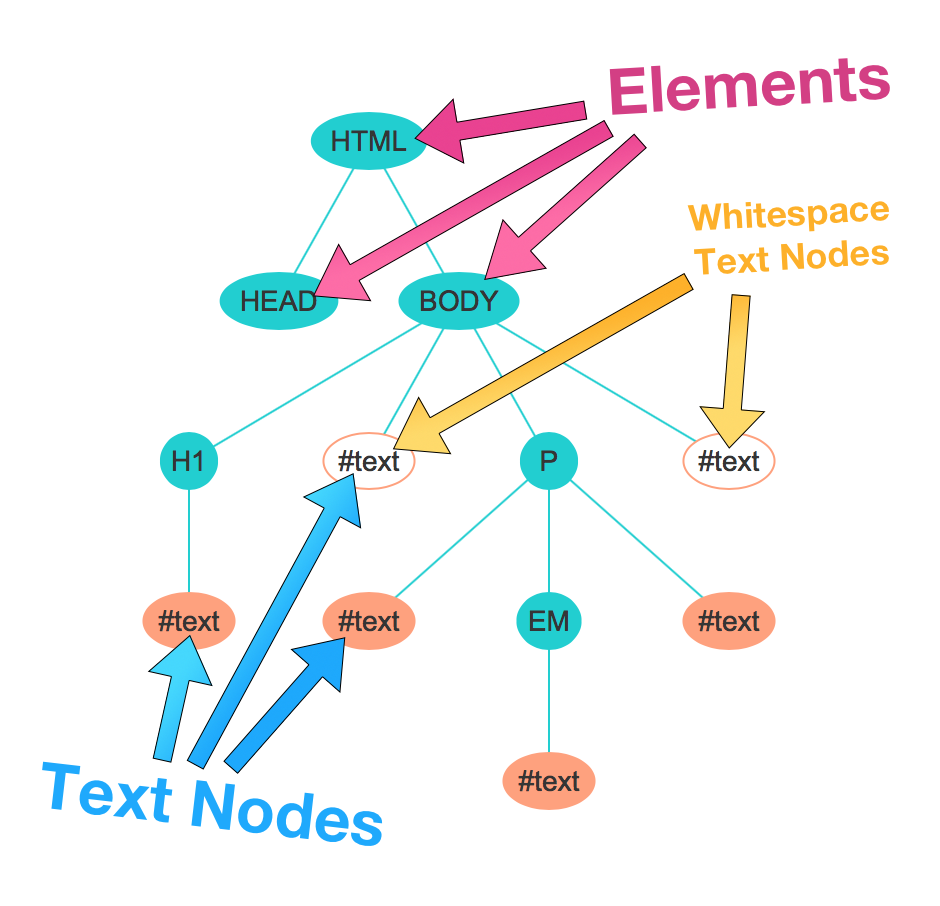

The DOM
========================


# 1	Introduction


# 2	The Document Object Model (DOM)

https://css-tricks.com/dom/

>*JavaScript* is a language that the browser reads and does stuff with. But *the DOM* is where that stuff happens. In fact a lot of what you might think of as a "JavaScript Thing" is more accurately a "DOM API".

https://www.w3.org/TR/DOM-Level-2-Core/introduction.html

[Introduction to the DOM](https://developer.mozilla.org/en-US/docs/Web/API/Document_Object_Model/Introduction)

[The Basics of JavaScript DOM Manipulation](http://callmenick.com/post/basics-javascript-dom-manipulation)


document
- any web page loaded in the browser 
- the  DOM tree itself


element
- e.g. createElement, getElementbyId
- a node in DOM
- implement the DOM Element interface 
- also the more basic Node interface


nodeList
- an array of elements
- accessed by index


Attribute
- e.g. createAttribute()
- a node in DOM


namedNodeMap
- an array of nodes
- accessed by name or index

## DOM Interface

# 3	Douglas Crockford: An Inconvenient API
https://www.youtube.com/watch?v=Fv9qT9joc0M

[DOM note](../../kb/webapi/_DOM.md)

# 4	A Hierarchy of Nodes



- element node
  - tags
- text node
  - text
  - comment
- whitespace text node 
  - any whitespace in html


[browser compatibility tables]()


# 5	Node Properties

what is a `node`?
- Node an interface
- a lot DOM types inerit from Node
- e.g. `Document`, `Element`, `CharacterData`,etc
- e.g. `querySelector` returns a node

what is `document`?
- the top-most node
- an JS object of type `HTMLDocument`
- inherits from `Node`

nodeName
- Elements:  uppercase version of the `tag`
- text nodes: `#text`
- comments: `#comment`

nodeType
- 1. Node.ELEMENT_NODE
- 3. Node.TEXT_NODE
- 8. Node.COMMENT_NODE
- 9. Node.DOCUMENT_NODE

nodeValue
- elements: null
- text nodes: whatever text in the node

textContent
- of a node and its descendants.

# 6	Determining the Type of a Node

```
EventTarget **event handling**
   |--Node **common behavior of all nodes**
        |--Text
        |--Comment
        |--Element
              |--HTMLElement **most html tags**
              |     |--HTMLAnchorElement
              |     |--HTMLBodyElement
              |     |--HTMLButtonElement
              |     |--HTMLCanvasElement
              |     |--HTMLDivElement
              |     |--HTMLDocument
              |     |--HTMLFormElement
              |     |--HTMLHeadingElement
              |     |--HTMLHtmlElement
              |     |--HTMLImageElement
              |     |--HTMLInputElement
              |     |--HTMLLIElement
              |     |--HTMLLabelElement
              |     |--etc, etc.
              |
              |--SVGElement
                    |--SVGColorElement
                    |--SVGRectElement
                    |--etc, etc.
```


What type of a node is in Console?
- `node.toString()`
- exception: `a.constructor`


What type of a node is in JS?

```
> p.instanceof(HTMLElement);
= true
> p.instanceof(Element);
= true
> p.instanceof(Node);
= true
> p.instanceof(SVGElement);
= false
```

# 7	Inheritance and Finding Documentation

- mdn document
- inheritance tree on the left panel
- browser compatibility table on the bottom


# 8	Traversing Nodes

- `firstChild`	childNodes[0] or null
- `lastChild`	childNodes[childNodes.size-1] or null
- `childNodes`	Live collection of all child nodes
- `nextSibling`	parentNode.childNodes[n+1] or null
- `previousSibling`	parentNode.childNodes[n-1] or null
- `parentNode`	Immediate parent of this node


# 9	Element Attributes
get/set attribute

attribute property
- `id, name, title, value` are exported as property

class
- `className` (space-delimited)
- `classList` array-like 
  - add(name)	Add the class name to the element
  - remove(name)	Removes the class name from the element
  - toggle(name)	Adds the class name unless it exists, in which case it is removed.
  - contains(name)	Returns true or false depending on if the element has the class name.
  - length	The number of classes on the element.

style
- Every CSS property can be modified using the style attribute.
- e.g. `h1.style.lineHeight = '3em';`, `h1.style.color = 'red`;, `h1.style.color = null;`


# 10	Exercises: Traversing and Accessing Attributes


# 11	Finding DOM Nodes


# 12	Traversing Elements

# 13	Exercises: Finding Nodes and Traversing Elements


# 14	Creating and Moving DOM Nodes


# 15	The Browser Object Model (BOM)


# 16	Exercises: the DOM


# 17	Summary