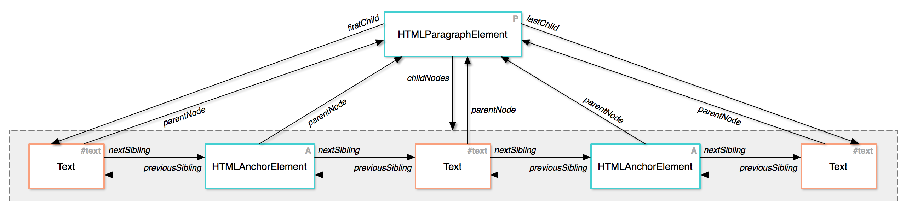
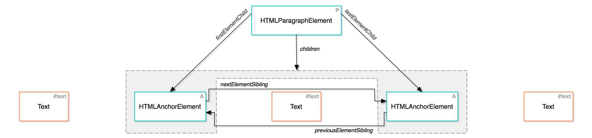

The DOM
========================


# 1	Introduction


# 2	The Document Object Model (DOM)

https://css-tricks.com/dom/

> *JavaScript* is a language that the browser reads and does stuff with. But *the DOM* is where that stuff happens. In fact a lot of what you might think of as a "JavaScript Thing" is more accurately a "DOM API".

https://www.w3.org/TR/DOM-Level-2-Core/introduction.html

[Introduction to the DOM](https://developer.mozilla.org/en-US/docs/Web/API/Document_Object_Model/Introduction)

[The Basics of JavaScript DOM Manipulation](http://callmenick.com/post/basics-javascript-dom-manipulation)

document
- any web page loaded in the browser 
- the  DOM tree itself


element
- e.g. createElement, getElementbyId
- a node in DOM
- implement the DOM Element interface 
- also the more basic Node interface


nodeList
- an array of elements
- accessed by index


Attribute
- e.g. createAttribute()
- a node in DOM


namedNodeMap
- an array of nodes
- accessed by name or index

## DOM Interface

# 3	Douglas Crockford: An Inconvenient API
https://www.youtube.com/watch?v=Fv9qT9joc0M

[DOM note](../../kb/dom/_DOM.md)

# 4	A Hierarchy of Nodes


- element node
  - tags
- text node
  - text
  - comment
- whitespace text node 
  - any whitespace in html


[browser compatibility tables]()


# 5	Node Properties

what is a `node`?
- Node an interface
- a lot DOM types inerit from Node
- e.g. `Document`, `Element`, `CharacterData`,etc
- e.g. `querySelector` returns a node

what is `document`?
- the top-most node
- an JS object of type `HTMLDocument`
- inherits from `Node`

nodeName
- Elements:  uppercase version of the `tag`
- text nodes: `#text`
- comments: `#comment`

nodeType
- 1. Node.ELEMENT_NODE
- 3. Node.TEXT_NODE
- 8. Node.COMMENT_NODE
- 9. Node.DOCUMENT_NODE

nodeValue
- elements: null
- text nodes: whatever text in the node

textContent
- of a node and its descendants.

data
- https://dom.spec.whatwg.org/#concept-cd-data

> CharacterData is an abstract interface and does not exist as node. It is used by Text, ProcessingInstruction, and Comment nodes.
>
> Each node inheriting from the CharacterData interface has an associated mutable string called data.

# 6	Determining the Type of a Node

```
EventTarget **event handling**
   |--Node **common behavior of all nodes**
        |--Text
        |--Comment
        |--Element
              |--HTMLElement **most html tags**
              |     |--HTMLAnchorElement
              |     |--HTMLBodyElement
              |     |--HTMLButtonElement
              |     |--HTMLCanvasElement
              |     |--HTMLDivElement
              |     |--HTMLDocument
              |     |--HTMLFormElement
              |     |--HTMLHeadingElement
              |     |--HTMLHtmlElement
              |     |--HTMLImageElement
              |     |--HTMLInputElement
              |     |--HTMLLIElement
              |     |--HTMLLabelElement
              |     |--etc, etc.
              |
              |--SVGElement
                    |--SVGColorElement
                    |--SVGRectElement
                    |--etc, etc.
```


What type of a node is in Console?
- `node.toString()`
- exception: `a.constructor`


What type of a node is in JS?

```
> p.instanceof(HTMLElement);
= true
> p.instanceof(Element);
= true
> p.instanceof(Node);
= true
> p.instanceof(SVGElement);
= false
```

# 7	Inheritance and Finding Documentation

- mdn document
- inheritance tree on the left panel
- browser compatibility table on the bottom


# 8	Traversing Nodes

- `firstChild`	childNodes[0] or null
- `lastChild`	childNodes[childNodes.size-1] or null
- `childNodes`	Live collection of all child nodes
- `nextSibling`	parentNode.childNodes[n+1] or null
- `previousSibling`	parentNode.childNodes[n-1] or null
- `parentNode`	Immediate parent of this node


# 9	Element Attributes

get/set attribute

attribute property
- `id, name, title, value` are exported as property

class
- `className` (space-delimited)
- `classList` array-like 
  - add(name)	Add the class name to the element
  - remove(name)	Removes the class name from the element
  - `toggle(name)`	Adds the class name unless it exists, in which case it is removed.
  - contains(name)	Returns true or false depending on if the element has the class name.
  - length	The number of classes on the element.

style
- Every CSS property can be modified using the style attribute.
- e.g. `h1.style.lineHeight = '3em';`, `h1.style.color = 'red`;, `h1.style.color = null;`
# 10	Exercises: Traversing and Accessing Attributes

1. Write JavaScript to determine how many total images are on the webpage and how many of those images are in the PNG format.

# 11	Finding DOM Nodes

Finding An Element By Id
- document.getElementById, nodeChilds.forEach(), 

Finding Multiple Elements
- document.getElementsByTagName(tagName), HTMLCollection
- document.getElementsByClassName(className)

Using CSS Selectors
- document.querySelector(selector)
- document.querySelectorAll(Selector)

HTMLCollection or NodeList
- `instanceof` operator
- no `forEach`
- use `for` loops instead

# 12	Traversing Elements

all child nodes (text / element)
- parentNode
- childNodes, firstChild, lastChild,
- nextSibling, previousSibling



vs

element child nodes (element)
- parentNode
- children, firstElementChild, lastElementChild
- nextElementSibling, previousElementSibling




> Internet Explorer doesn't provide these newer methods on document, but they are available on any other Element. A workaround for this is to use document.body, which is an Element, instead of document, which is a Document.

textContent (text)

- It's important to be careful when setting a value to `textContent`, because doing do will remove all child nodes from the Element and replace them with a single Text Node containing the specified value:

- The best way to handle updating text on a page is to always keep text that needs to be updated via JavaScript within an Element, even if that Element is a <span> or <div> that serves no other purpose. 

```html
<html>
  <body>
    <div>
      Welcome to the site!<br>
      The time is <span class="time">9:15 am</span>.<br>
      You are logged in as <a href="/account">Kabu</a>.
    </div>
  </body>
</html>

document.querySelector('span.time').textContent = '9:16 am';
```

# 13	Exercises: Finding Nodes and Traversing Elements

NodeList / HTMLCollection to JS Array?
- `var arr = Array.prototype.slice.call(htmlCollection)`
- `var arr = [].slice.call(arrLike)`

# 14	Creating and Moving DOM Nodes

create node
- document.createElement(tagName)
- document.createTextNode(text)
- node.cloneNode(deepClone)
  - always explicitly set to `false` to copy one node only

> Warning: cloneNode() may lead to duplicate element IDs in a document.

add node (to `document.body`)
- parent.appendChild(node)
- parent.insertBefore(node, targetNode)
- parent.replaceChild(node, targetNode)

> A Node can not be in the DOM more than once. If a Node that is already in the DOM is inserted in a new location, it is removed from its original location. This means that all that is needed to move a DOM Node is inserting it at its new location.

- element.insertAdjacentElement(position
- element.insertAdjacentText(position, text)
  - `beforebegin`	Before the element itself
  - `afterbegin`	Just inside the element, before its first child
  - `beforeend`	Just inside the element, after its last child
  - `afterend`	After the element itself

remove node
- node.remove()
- parent.removeChild(node)

# 15	The Browser Object Model (BOM)

Window

- The window object represents a window containing a DOM document; the document property points to the DOM document loaded in that window
- In a tabbed browser, such as Firefox, each tab contains its own window object (and if you're writing an extension, the browser window itself is a separate window too 

history
- back()
- forward()
- go()
- pushState()

sensors
- location


# 16	Exercises: the DOM

http://d186loudes4jlv.cloudfront.net/fe2/exercises_objects_and_dom/dom_assignment.html

- onclick = function(event) {`this`: target DOM node}
- GlobalEventHandlers
- event.preventDefault

```js
document.getElementById('toggle').onclick = function(e) {
  e.preventDefault();
  var notice = document.getElementById('notice');
  if (notice.getAttribute('class') === 'hidden') {
    notice.setAttribute('class', 'visible');
  } else {
    notice.setAttribute('class', 'hidden');
  }
};
```
node.innerText
- Node.textContent is a somewhat similar alternative, although there are important differences between the two.


# 17	Summary

- The Document Object Model, or DOM, is an **in-memory** object representation of an HTML document. It provides a way to interact with a web page using JavaScript, which provides the functionality required to build modern interactive user experiences.

- The DOM is made up of a hierarchy of nodes. Each node can contain any number of child nodes.

- There are several types of nodes. The types you should be familiar with and know the differences between are *elements* and *text nodes*.

- The *whitespace in an HTML document* will result in many *empty text nodes appearing in the DOM*.

- Useful properties of nodes include `nodeName, nodeType, nodeValue, and textContent`.
  - nodeName: tag name, p, input, article
  - nodeType element 1, text 3, comment 8, document 9
  - nodeValue: text on text/comment, null on the rest
  - textContent: a collection of nodeValue of all its descendants

- Nodes have many properties for traversing the DOM tree: firstChild, lastChild, childNodes, nextSibling, previousSibling, and parentNode.

- Element nodes have `getAttribute`, `setAttribute`, and `hasAttribute` methods for manipulating HTML attributes.

- Elements have special properties `id`, `name`, `title`, and `value` that can be modified using the property on the element object directly. *shortcuts of get/set attribute*

- Elements have special support for modifying their CSS classes and style properties using the `classList` and `style` properties.

- `document.getElementById(id)` is used to find a single Element with the specified id.

- `document.getElementsTagName(name)` and `document.getElementsByClassName(name)` are used to find any Elements with the specified tagName or class.

- `document.querySelector(selector)` returns the first Element that matches the specified CSS selector. `document.querySelectorAll(selector)` is similar but returns all matching elements.

- Elements have many properties for traversing the DOM tree: `firstElementChild, lastElementChild, children, nextElementSibling, and previousElementSibling`. // not include text/comment node

- New DOM nodes can be created using `document.createElement(tagName)` or `document.createTextNode(text)`.

- A copy of a node can be obtained using `mode.cloneNode(deepClone)`.

- `parent.appendChild(node), parent.insertBefore(node, targetNode), parent.replaceChild(node, targetNode), element.insertAdjacentElement(position, newElement), and element.insertAdjacentText(position, text)` are used to add nodes to the DOM.

- `node.remove() and parent.removeChild(node)` are used to remove nodes from the DOM.