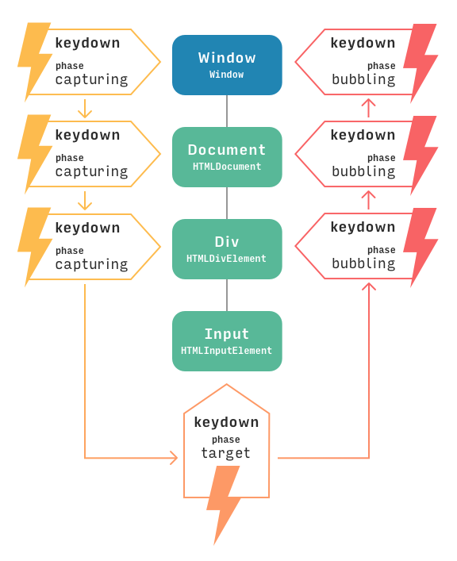

Event-Driven and Asynchronous Programming
===========================================


# 1	Introduction

# 2	Timeouts and Intervals

```
var timeoutID = setTimeout(func, delay) 
clearTimeout(timeoutID)

var  intervalID = setInterval(func, delay) 
clearInterval(intervalID)
```

# 3	User Interfaces and Events

event
- info about *what and where* it happened
- `addEventListener`
- `removeEventListener`

- [event type](https://developer.mozilla.org/en-US/docs/Web/Events) 

# 4	A Simple Example
- addEventListener
- onclick

# 5	Page Lifecycle Events

```
html file
-> html parse +  js evalation
-> DOM tree
-> `DOMContentLoaded` event
-> page displayed
-> assets loaded
-> `load` event

```


# 6	User Events

Keyboard
- keydown,
- keyup,
- keypress

Mouse	
- mouseenter,
- mouseleave,
-  mousedown,
-  mouseup,
- click

Touch	
- touchdown,
- touchup,
- touchmove

Window
- scroll,
- resize

Form 
- submit

# 7	Adding Event Listeners

- Register on the event handler of `DOMContentLoaded`
- after the DOM tree constructed


# 8	The Event Object
- `e.type` a string, case insensitive, e.g. click
- `e.currentTarget` The object that is currently being targetted as the event bubbles up the DOM. This will be the object the event handler was attached to.
- `e.target` The object the event originally was fired upon. **inner most**

keyboard event
- which // keyCode **preferred**
- key // letter
- keyup/keydown/keypress(only for none modifier keys)

# 9	Capturing and Bubbling



> Capturing vs. Bubbling
>
>As a general rule, you should define event listeners for the bubbling phase of events, which does not require the use of the third useCapture argument. Most code you write will work in this way.
>
>We have covered the capturing phase in order to provide a complete picture of how event dispatch works within the browser and so that you would be aware of that phase of event handling should you encounter it.

# 10	Preventing Propagation and Default Behaviors

- event.stopPropagation()
- event.preventDefault()

> It is a good practice to call preventDefault() or stopPropagation() as early as possible in an event handler. 

# 11	Event Delegation

This technique of *attaching a single event handler at a higher location in the DOM* is called event delegation.

When To Use Event Delegation?

- The best approach is to start out directly binding event handlers to elements as needed when a project is new and small. As the size of the code increases, there may be situation where it makes sense to use event delegation to decrease the number of event handlers required by a page. jQuery (which we'll look at in an upcoming lesson) also includes some functionality to make using this technique simpler and avoids its main downside, which is the complexity of identifying which element and behavior need to be invoked in response to an event.

# 12	What is the Event Loop?

[Philip Roberts: What the heck is the event loop anyway? | JSConf EU 2014](https://www.youtube.com/watch?v=8aGhZQkoFbQ)

## JS runtime: 
- single thread, single call stack, single task queue
- async call back, event handler

## webapis
- concurrency 
- event loop / task queue or call back queue

## callback queue
- just one queue
- pick cb from callback  queue **when stack is clear** (when thread is idle)

## render queue
- when sync executing, reunder queue is blocked, ui is stucked

```
JS stack `setTimeout(5s)`
webapis `timer(callback)` running
callback queue

JS stack 
webapis `timer(callback)` 5 seconds...
callback queue

JS stack 
webapis 
callback queue `callback`

JS stack `callback`
webapis 
callback queue 
```


# 13	Assignment: Guessing Game
# 14	Assignment: Build an Input Box

quesiton
- keydown on `div` or `document`
- must be focusable control, to walk around set a tabIndex

# 15	Summary

- `setTimeout(callback, delay)` is used to invoke a Function after the specified number of milliseconds, 0 ms is used to invoke when callback queue is empty

- `setInterval(callback, delay)` is used to repeatedly invoke a Function after the specified number of milliseconds. clearInterval can be used to prevent future invocations of the Function.

- An event is an object that represents some occurrence and contains a variety of information about what and where it happened. Events can be triggered by the browser as it loads a page, by a user as they interact with the page, and by the browser as it performs work as directed by a program.

- **Code that needs access to the DOM should be invoked after the `DOMContentLoaded` event is fired on document.**

- User events are used to drive most user interfaces and can be the result of a user interacting with the keyboard, mouse, touchscreen, window, and more. Examples of these user events are click, mouseover, keydown, and scroll.

- **Event listeners are callbacks** that will be invoked whenever a matching event is detected.

- `element.addEventListener` is used to register an event listener.

- The Event object provides the useful properties `type, target, and currentTarget`.

- **Keyboard events** have properties `which` and `key` (and others) that describe what keys were pressed. Mouse events similarly provide `button`, `clientX`, and `clientY`.

- There are three phases to events being fired: **capturing, target, and bubbling**.

- `event.preventDefault()` is used to prevent default browser behavior in response to an event. `event.stopPropagation` stops the event from being triggered on other containing or contained elements.

- **Event delegation** is a technique used to handle events triggered by **multiple elements using a single event handler.**

# 16	Assessment: Context, Events, and the DOM

[x] Context
[ ] Event
[ ] the DOM