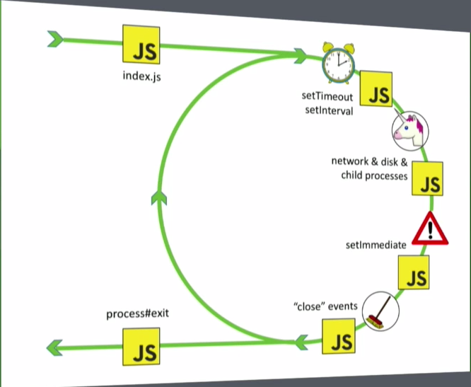
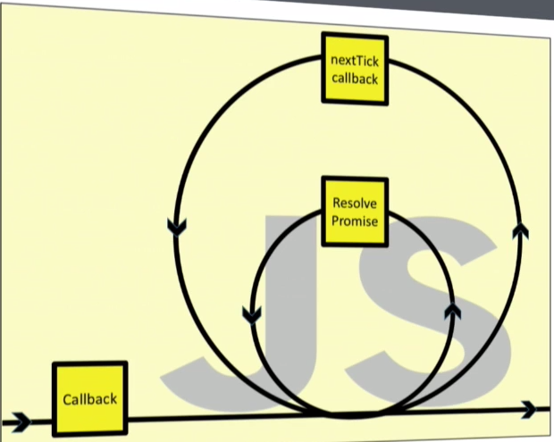

### Event Loop

https://jakearchibald.com/2015/tasks-microtasks-queues-and-schedules/

> An event loop has one or more task queues. A task queue is an ordered list of tasks, which are algorithms that are responsible for such work as:

> 一个 eventloop 有一或多个 task 队列。每个 task 由一个确定的 task 源提供。从不同 task 源而来的 task 可能会放到不同的 task 队列中。
> 例如，浏览器可能单独为鼠标键盘事件维护一个 task 队列，所有其他 task 都放到另一个 task 队列。通过区分 task 队列的优先级，使高优先级的 task 优先执行，保证更好的交互体验。



#### Task Queue (Macrotask)
- event callbacks
- XHR callbacks
- IndexDB I/O
- setTimeout/setInterval
- history.back

#### Microtask Queue
are usually scheduled for things that should happen **straight after** the currently executing script
经常是为需要直接在当前脚本执行完后立即发生的事
- **Promise.then**
- MutationObserver
- Object.observe
- process.nextTick

order: script execution,  microtask queue, task

http://latentflip.com/loupe/

```js
// 1. register DOM cb -> c++
$.on('button', 'click', function onClick() {
    // 5. register cb -> c++
    setTimeout(function timer() {
        console.log('You clicked the button!');    
    }, 2000);
});
// 2. print
console.log("Hi!");
// 3. register cb -> c++
setTimeout(function timeout() {
    console.log("Click the button!");
}, 5000);
// 4. print
console.log("Welcome to loupe.");

/*
Output:
Hi!
Welcome to loupe.
Click the button!
You clicked the button!
*/

```

### NodeJS Event Loop

***!!! watch this please*** 

https://www.youtube.com/watch?v=PNa9OMajw9w

https://www.dynatrace.com/blog/all-you-need-to-know-to-really-understand-the-node-js-event-loop-and-its-metrics/

https://nodejs.org/en/docs/guides/event-loop-timers-and-nexttick/


> Node.js is an event-based platform. This means that everything that happens in Node is the reaction to an event. A transaction passing through Node traverses a cascade of callbacks. 

> This is all handled by a library called libuv which provides a mechanism called an event loop.

> **There is only one thread that executes JavaScript code and this is the thread where the event loop is running**. The execution of callbacks (know that every userland code in a running Node.js application is a callback) is done by the event loop. 

> Whenever possible, libuv will use those asynchronous interfaces, avoiding usage of the thread pool.

```
-->-- index.js 
   ^      setTimeout/setInterval (timer)
   |      network & disk & child processes (IO callbacks)
   |      poll  <-- incoming: connections, data
   |      setImmediate
   |      "close" events
--<-- process#exit
```

### inside event loop



every yellow box contains a loop internally (callbacks), and a smaller one (resove promise)

check resolve promise until no more resolved promise, then callback


### libuv

run one loop in one thread