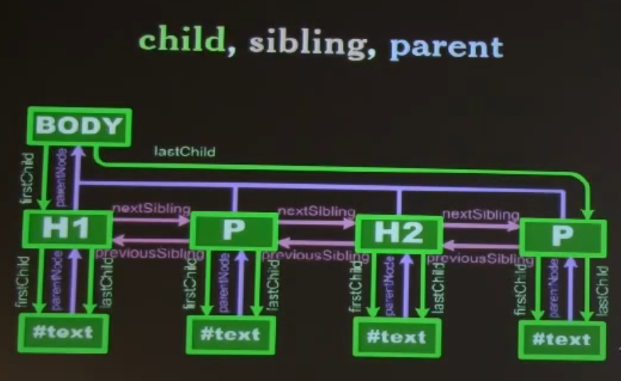

[How browsers work](http://taligarsiel.com/Projects/howbrowserswork1.htm)

# Douglas Crockford Lecture: The Metamorphosis of Ajax

https://www.youtube.com/watch?v=Fv9qT9joc0M

## DOM - browser's API

document.write *Bad*
- allow JS to produce html text

script tag
- big impact on page loading times
- place `script` to the bottom fo `body` as possible, and place css `link` as high in the `head` as possible

## Document Tree Structure

```
#document `document`
  |----html `document.`
      |----head `documentElement`
      |----body `document.body`
            |----h1
            |    |----#test  
            |----p
            |    |----#test
            |----p
                |----#test

```

## child, sibling, parent
- `firstChild` `lastChild`
- `previousSibling` `nextSibling`
- `parent`
- should be enough just `firstChild`, `nextSibling`, like a`p` and `p->next`





## Walk the DOM


## Retrieving Nodes
- `document.getElementsById(id)` // efficient
- `document.getElementsByName(name)`
- `node.getElementsByTagName(tagName)`


## Manipulating Elements
- change node peroperties, e.g. border, align, width,...
- or getAttribute, setAttribute

## Style

W3C and EMCA doesn't cooprate

CSS (dash)
- background-color
- border-radius

JavaScript (camel)
- backgroundColor
- borderRadius

Making Elements
- `document.createElement(tagName)`
- `document.createTextNode(text)`
- `node.cloneNode()`
- `node.cloneNode(true)` // all of its descendents
- *the new nodes are not connected to the document*

Linking Elements
- `node.appendChild(new)`
- `node.insertBefore(new, sibling)`
- `node.replacerChild(new, old)`
e.g. `old.parentNode.replaceChild(new, old)`


Removing Elements
- ``
